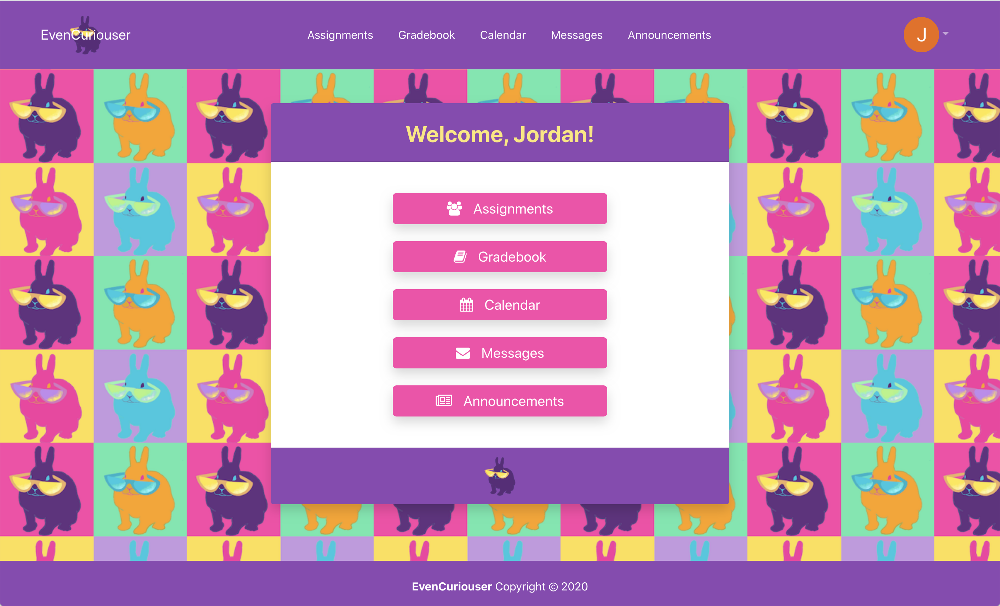

# EvenCuriouser

## Description of the Site

"EvenCuriouser" is a full stack application to help teachers and students have a better teaching and learning experience.

School in 2020, has been hard for everyone involved and jumping from one application to another was a common complaint from teachers, students and parents. 

This application was designed to try and bring all of the links, assignments, grades, and messaging systems into one centralized location.  Making school - whether it's face to face, virtual, or hybrid - seamless and easy for everyone. 

## Pictures of the Site

[EvenCuriouser](https://even-curiouser.herokuapp.com/)

## Built With
- [React](https://reactjs.org/)

- [CSS](https://developer.mozilla.org/en-US/docs/Web/CSS)

- [JavaScript](https://developer.mozilla.org/en-US/docs/Web/JavaScript)

- [Node.js](https://nodejs.org/en/about/)

- [NPM](https://docs.npmjs.com/about-npm/)
  
- [JSX](https://developer.mozilla.org/en-US/docs/Learn/Tools_and_testing/Client-side_JavaScript_frameworks/React_getting_started)

- [MySQL](https://www.mysql.com/)

## Some of the NPM's Used

- [Express](https://www.npmjs.com/package/express)
- [Axios](https://www.npmjs.com/package/axios)
- [Auth0](https://www.npmjs.com/package/auth0)
- [dotenv](https://www.npmjs.com/package/dotenv)
- [Socket.io](https://www.npmjs.com/package/socket.io)
- [mySQL2](https://www.npmjs.com/package/mysql2)
- [Sequelize](https://www.npmjs.com/package/sequelize)

## Version

- [Github](https://github.com/)

## Deployment

- [Heroku](https://devcenter.heroku.com/)

## Databases

- [MySQL](https://www.mysql.com/)

## Front-End Design Repo

- [Design Repo](https://github.com/aanielson/evenCurioserTest.git)

# Authors

- [Abby Nielson](https://github.com/aanielson)
- [Jordan Call](https://github.com/JCCALL)
- [Lindsey Paluso](https://github.com/lindseypaluso) 
- [Lisa Campbell](https://github.com/lisaswindler)
